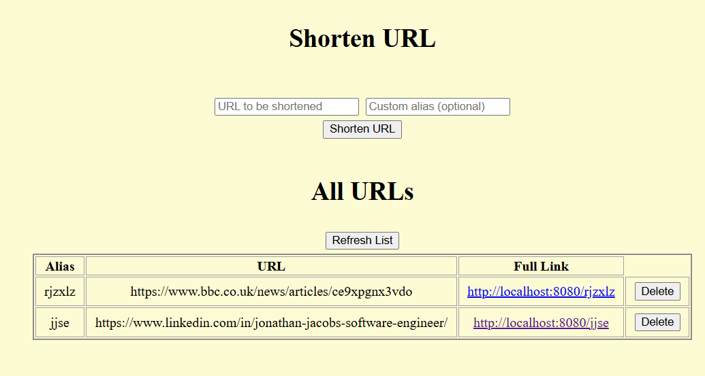

# URL Shortener Coding Task Submission Notes

## Start Up Guide
- Run gradlew buildDockerAndRun from root directory.
- If you need to change the port the application runs on then this can be found on line 43 of build.gradle.

## Example Queries
Following examples presume application is running on localhost port 8080 and consist of curl commands which can be imported into Postman.

- To save a URL with a custom alias:
~~~
curl --location 'http://localhost:8080/shorten' \
--header 'Content-Type: application/json' \
--data '{
    "fullUrl": "https://example.com/very/long/url",
    "customAlias": "my-custom-alias"
}'
~~~
- To save a URL with a randomly generated alias:
~~~
curl --location 'http://localhost:8080/shorten' \
--header 'Content-Type: application/json' \
--data '{
    "fullUrl": "https://example.com/very/long/url"
}'
~~~
- To retrieve a list of all stored aliases:
~~~
curl --location 'http://localhost:8080/urls'
~~~
- To delete an alias:
~~~
curl --location --request DELETE 'http://localhost:8080/my-custom-alias'
~~~
- To be redirected to original URL:
~~~
curl --location 'http://localhost:8080/my-custom-alias'
~~~

## User Interface

- The user interface can be accessed at <domain>/view-urls eg. http://localhost:8080/view-urls.
- Enter the desired URL into the box marked "URL to be Shortened".
- Optionally enter a custom URL into the box marked "Custom alias (optional)". If none is provided then one will be randomly generated.
- Press "Shorten URL" to submit the URL and optional alias to be shortened.
- To delete a stored URL and alias press "Delete" in the relevant table row.
- The list of stored aliases can be updated at any time by pressing "Refresh List".

## Assumptions
- Only one alias should be saved for each URL. Any duplicates will be rejected.

## Notes
- Developed using IntelliJ and Docker Desktop.